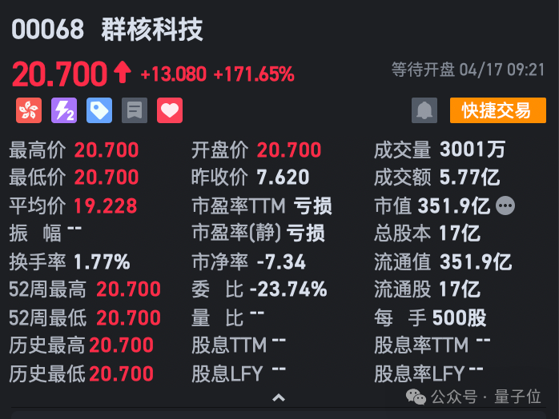
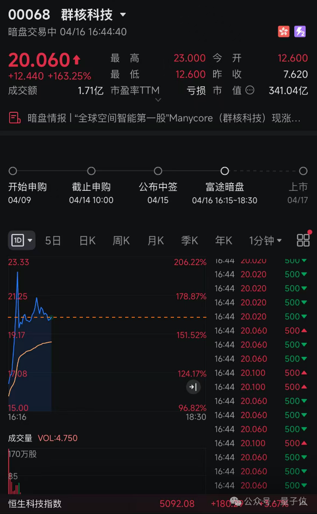
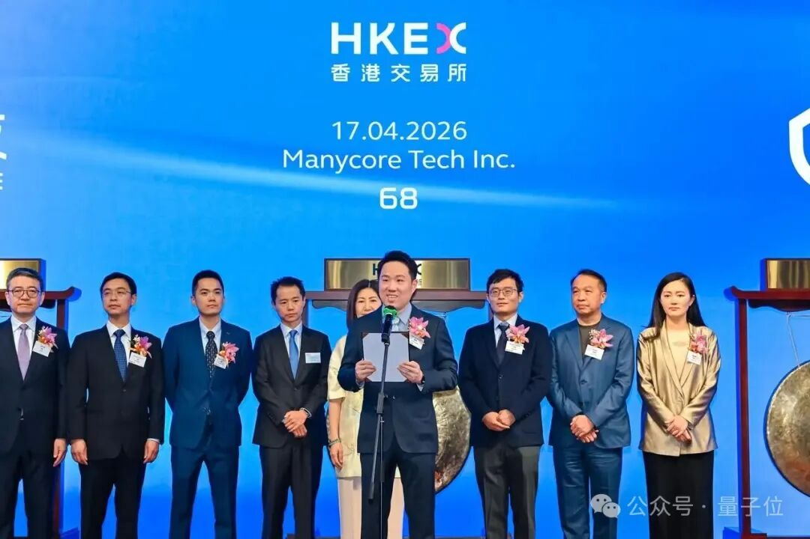
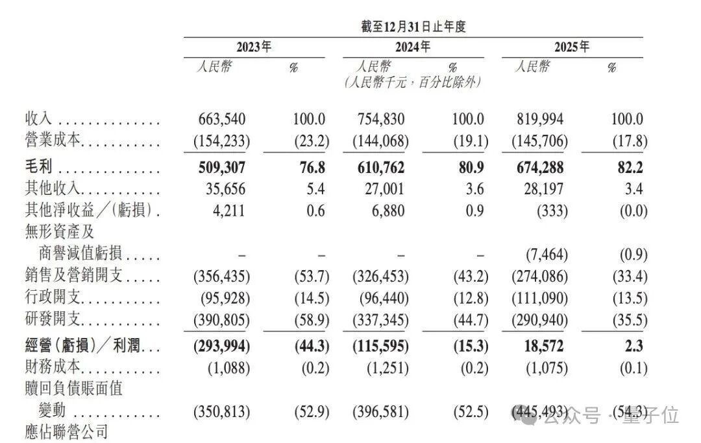
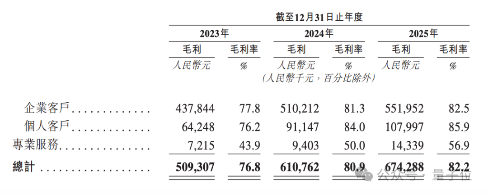

# 空间智能第一股，开盘暴涨171%！李飞飞押注的赛道，杭州六小龙之一跑通了

> 公众号：量子位 | 发布时间：2026年4月17日

## 内容摘要

空间智能赛道迎来首个上市公司，开盘暴涨171%。李飞飞等顶级AI科学家押注的方向终于跑通商业模式。文章深入分析了空间智能的定义、技术路径、市场前景及主要玩家格局。

## 图片存档

- 
- 
- 
- 
- 
- 
- 
- 
- 
- 
- 
