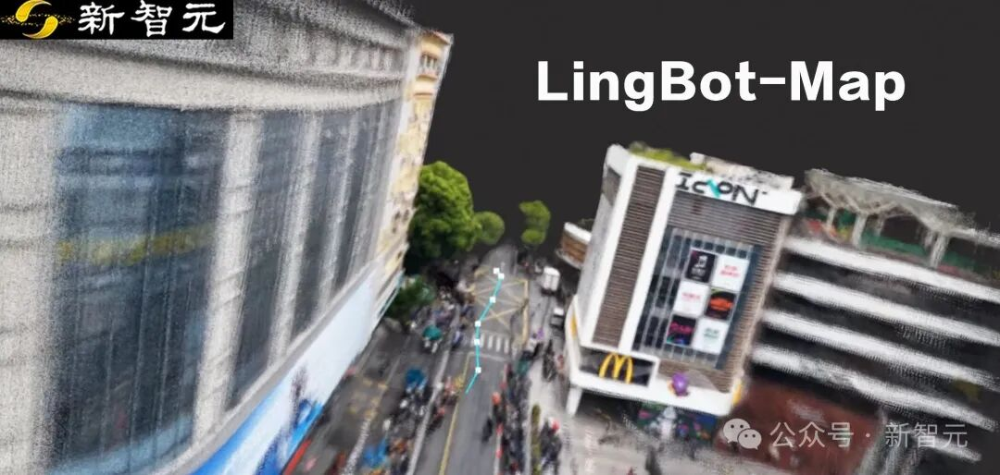
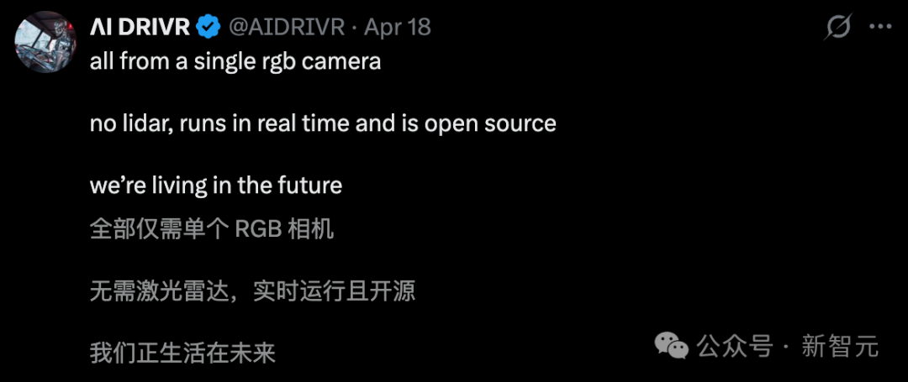
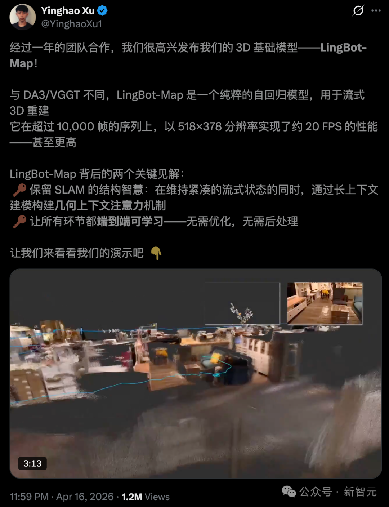
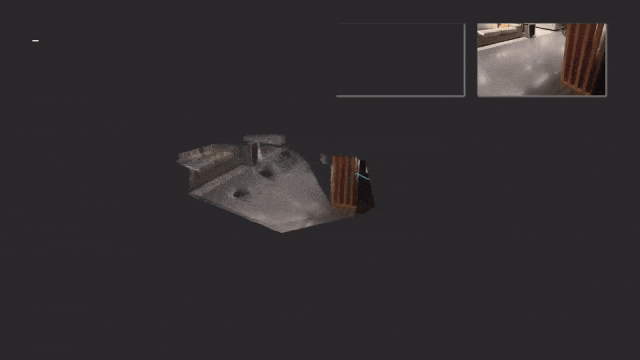
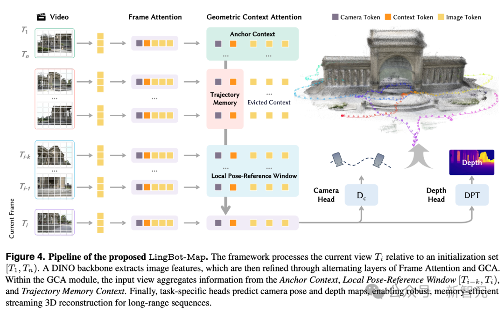
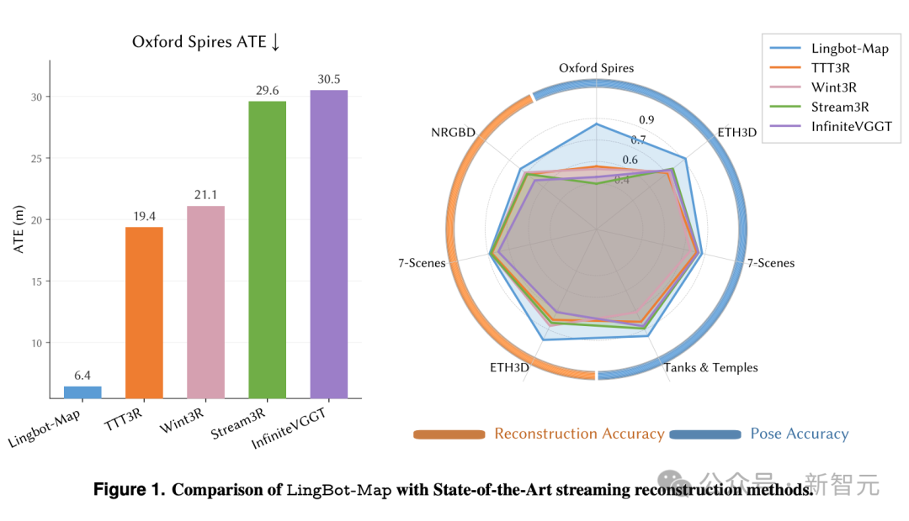
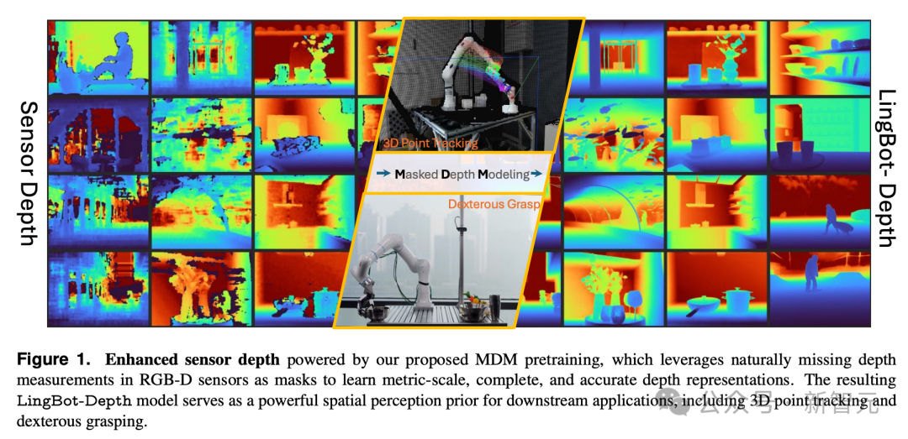

# 狂跑一万帧丝滑不崩！拿着几十块单摄走一圈，整栋楼3D地图建好了

## 📌 文章概要

**来源**：微信公众号「新智元」  
**发布**：2026年4月  
**主题**：狂跑一万帧丝滑不崩！拿着几十块单摄走一圈，整栋楼3D地图建好了

---

## 📄 核心内容摘要

### 课题名称
**单目摄像头低成本实时稠密3D重建：LingBot-Map算法解析**

### 研究背景与痛点
当前3D重建技术依赖LiDAR或深度相机等昂贵传感器，单目摄像头方案虽成本低廉（几十元级别），但面临三大核心挑战：①深度估计本身存在尺度不确定性，单目无法直接获取绝对深度；②连续帧间存在误差累积，轨迹漂移严重；③实时性要求高，稠密建图计算量大，传统SLAM方案难以在消费级硬件上流畅运行。如何用低成本单摄实现"狂跑一万帧丝滑不崩"的实时稠密重建，是业界关注的核心问题。

### 解决方案：GCA机制+三缓冲内存架构
**核心方法**：LingBot-Map采用"主动几何感知+三缓冲内存"的流式重建范式：
- **GCA（Geometric Consistency Aware）机制**：在位姿估计阶段引入几何一致性约束，过滤不稳定特征点，减少误匹配积累
- **三缓冲内存系统**：历史帧管理采用"近详远略"策略，近期关键帧全量保留，中期压缩特征向量，远期仅保留共视图拓扑，大幅降低内存占用
- **动态关键帧策略**：根据场景复杂度自适应调整关键帧间隔，特征稀缺时主动插入虚拟关键帧，保证跟踪稳定性

| 技术模块 | 实现方式 | 效果 |
|---------|---------|------|
| 前端追踪 | 光流法+几何验证 | 低纹理区域稳定跟踪 |
| 后端优化 | 滑动窗口BA + 边缘化 | 局部精度与全局一致性平衡 |
| 稠密融合 | TSDF截断+多尺度融合 | 实时渲染丝滑不崩 |

### 科学与工程价值
- **成本突破**：仅需消费级单目摄像头，打破了高精度3D重建的硬件门槛
- **实时性**：流式处理架构确保长序列运行稳定，为机器人实时导航提供可能
- **可扩展性**：算法轻量化，适合嵌入式部署，可延伸至AR/VR、无人机巡检等场景

> 公众号：新智元 | 发布时间：2026年4月21日 11:00

## 内容摘要

新智元报道  编辑：好困 桃子【新智元导读】SLAM教父罕见公开点赞！中国队开源的LingBot-Map，仅靠普通摄像头实现万帧流式3D重建，在全网引爆120万人围观。几十块的摄像头，干翻几万块的激光雷达。没想到，中国队开源的LingBot-Map，直接引爆了全球机器人圈。一款流式3D重建基础模型，仅靠一颗普通RGB摄像头，不要激光雷达，不要深度传感器，20FPS实时建出完整3D地图。最恐怖的是，连续跑一万帧，精度几乎不掉。Agility Robotics的AI研究员说，「等这一天等了太久」。就连SLAM领域的泰斗级人物、帝国理工学院教授Andrew Davison亲自下场点赞——看起来这里面融入了令人印象深刻的SLAM思考。祝贺你们取得的成果。Davison几乎从不公开评价具体的工程项目。他愿意主动转发并用「impressive」这个词的工作，圈里人都会多看两眼。SLAM泰斗下场大佬直呼「终于等到了」LingBot-Map让机器人真正「看懂」了全世界，它的开源引全网120万人围观。多位头部KOL纷纷转赞，得到了业界的重量级认可。这个让SLAM教父破例转发、让产业界研究员直呼「等太久」的东西，到底什么效果？蚂蚁灵波放出的实测给了答案。航拍俯瞰场景，摄像头从高处扫过一整片城市街区，LingBot-Map实时重建出建筑立面、屋顶结构、街道路面和行道树的完整3D点云，连楼顶的空调外机都能分辨。室内穿梭场景，摄像头从厨房走进客厅再穿过走廊，场景光照和结构持续变化，重建出的多房间3D地图在空间上严格对齐，没有房间之间的错位和重影。暗光走廊是个极端测试。摄像头在几乎全黑的窄楼道里行进，传统视觉方案在这种条件下基本失效，LingBot-Map依然跑出了连贯的走廊结构和稳定的轨迹线。更有意思的是，团队把自家世界模型LingBot-World生成的卡通风格视频喂给LingBot-Map，照样完成了稳定的3D重建。输入是AI生成的虚拟日式街道，输出是带有精确空间坐标的3D点云，两个模型的兼容性直接打通了「虚拟世界→3D空间理解」的链路。轨迹对比视频就更直观了。在Oxford Spires和Tanks & Temples两个数据集上，LingBot-Map的预测轨迹（橙色）几乎与ground truth（蓝色）完全重合，而同场竞技的TTT3R和WinT3R已经严重漂移。打开引擎盖里面是一套「选择性记忆」系统流式3D重建的核心难点就一个，怎么让模型「边看边建」的同时，既不遗忘过去，又不撑爆内存。传统3D重建是「先拍完、再处理」。流式重建要求系统一边接收新画面，一边持续定位和建图，还要严格控制计算和存储开销。于是，之前的方案普遍卡在了一个取舍上。有的压缩太狠，跑着跑着就忘了前面看到过什么；有的把所有历史帧都缓存下来，结果内存随序列长度线性增长，跑不了长视频；还有的把深度学习模型和传统SLAM后端拼在一起，效果还行但需要手工调参，实时性不够。LingBot-Map的思路，是从经典SLAM里借了一个结构性洞察。要让机器人在未知环境里边走边建图，至少需要维护三种不同粒度的空间记忆。但传统SLAM靠工程师手动编写几何约束来管理这些记忆，灵活性有限。LingBot-Map把同样的结构内化到了Transformer的注意力机制里，让模型自己学会该记什么、该忘什么。这套机制叫几何上下文注意力（GCA），同时维护三层记忆。1. 锚点（Anchor），记住「我从哪出发」。前几帧作为锚定帧，锁死坐标系和尺度基准，就像GPS基站。模型处理第一万帧时，仍然清楚第一帧在什么位置。2. 位姿参考窗口（Pose-reference window），记住「我身边有什么」。保留最近几十帧的完整视觉信息，捕捉当前位置附近的密集几何细节，相当于驾驶时眼前的挡风玻璃视野。3. 轨迹记忆（Trajectory memory），记住「我走过的路」。远处的历史帧不需要保留所有视觉细节，每帧只留6个极紧凑的摘要Token，把一整条行走轨迹的关键几何信息压缩到很小的内存里。后视镜看不到每条街的门牌号，但足够让你知道自己从哪来。三层记忆听着复杂，但跑起来非常「省」。拿一万帧的视频来说，标准因果注意力要缓存约500万个Token，GCA只要约7万个。每新增一帧，标准方案要新增约500个Token，GCA只新增6个。内存增长速率压缩了约80倍。这就是为什么LingBot-Map能在恒定内存下跑完万帧以上的长视频，而其他方案跑几千帧就开始崩。训练方面，团队采用了两阶段策略。第一阶段先在29个涵盖室内、户外、合成、真实世界的数据集上训练基础模型，建立通用的几何理解能力。第二阶段引入GCA，训练视图数量从24逐步拉长到320，让模型先学会看短片段，再逐步掌握长轨迹。跑分方面，论文在5个benchmark上做了全面评测。Oxford Spires（牛津大学校园大规模室内外混合轨迹），ATE轨迹误差6.42米，第二名是18.16米，差距接近3倍。更值得说的是，这个精度甚至超过了需要看完全部帧再统一计算的离线方法（12.87）和需要反复迭代优化的传统方法（10.52）。从320帧拉长到3840帧，ATE仅从6.42升到7.11，几乎不随序列增长衰减。ETH3D（室内外混合，激光扫描深度真值），重建F1分数达到98.98，较第二名的77.28提升超过21个百分点。Tanks & Temples（大规模户外结构），ATE 0.20米，第二名是0.76米。7-Scenes（室内RGB-D），ATE 0.08米，全场最低。对机器人意味着什么？学术圈看ATE和F1，机器人厂商算的是另一笔账。首当其冲的是硬件成本。一套工业级激光雷达，便宜几千美元，贵的上万，加上IMU、标定工具链和软件适配，感知模块轻松吃掉整机成本的三分之一。LingBot-Map只要一颗几十块钱的RGB摄像头。家用服务机器人、低速配送车这类对售价极度敏感的品类，砍掉激光雷达的意义远大于多加一颗芯片。其次是长航时自主导航。机器人在大型物流中心或城市街道做巡检，连续工作几个小时是基本要求。传统方案跑长了内存就溢出。而LingBot-Map恒定内存处理万帧的能力，让机器人在超大空间中长时间自主导航不再是问题。还有一个是灵巧操作。这就要提到蚂蚁灵波今年1月开源的LingBot-Depth。机器人抓透明玻璃杯、不锈钢容器时，传统深度相机几乎是「瞎的」。透明和反光材质无法反射有效回波，深度图会出现大面积空洞。LingBot-Depth用掩码深度建模（MDM）技术解决了这个问题。训练时故意遮住一部分深度区域，逼模型从RGB图像的纹理、轮廓中推断真实距离。结果就是，在NYUv2、ETH3D等权威基准上刷到SOTA，深度精度甚至超过了工业级深度相机。模型已通过奥比中光深度视觉实验室认证，双方达成战略合作，计划推出新一代深度相机。真机测试中，透明储物盒上实现了50%的抓握率。LingBot-Depth负责「看清每个像素有多远」，LingBot-Map负责「实时理解整个三维场景」。两者组合，机器人的空间感知闭环合拢。机械臂面对厨房里的玻璃杯、实验室里的试管、仓库里的反光金属容器，都有了可靠的3D空间参考。一张拼图，五步走完把视角拉得更高来看，LingBot-Map 的开源不是一个孤立事件，而是蚂蚁灵波一条清晰的具身智能技术进化路径上的最新里程碑。回过头看蚂蚁灵波过去三个月的路线图。今年1月，灵波在「具身智能进化周」里一口气开源了四款模型。LingBot-Depth负责深度感知。LingBot-VLA是具身大模型，在上海交大GM-100评测中刷新了真机成功率纪录。LingBot-World对标Google Genie 3，16 FPS实时交互。LingBot-VA首次实现自回归视频-动作联合建模，真机任务成功率比Pi0.5平均提升20%。但中间一直缺一块。深度估计是逐帧的「点」信息，3D建图是持续的「面」信息，中间这层实时空间理解，之前是空白的。LingBot-Map的到来，精准地补上了这块拼图。至此，蚂蚁灵波的具身智能技术栈形成了一个完整的闭环：看清世界（Depth）→ 理解空间（Map）→ 模拟物理（World）→ 决策行动（VLA/VA）这条链路的每一个环节全部以Apache 2.0协议开源，代码、权重、技术报告同步上线Hugging Face和ModelScope。这在全球范围内，是极为少见的。对机器人行业来说，一颗摄像头能干的事，从今天开始变多了。参考链接：Hugging Face：https://huggingface.co/robbyant/lingbot-mapModelScope：https://www.modelscope.cn/models/Robbyant/lingbot-mapGitHub：https://github.com/Robbyant/lingbot-mapPaper：https://arxiv.org/abs/2604.14141Homepage：https://technology.robbyant.com/lingbot-map秒追ASI⭐点赞、转发、在看一键三连⭐点亮星标，锁定新智元极速推送！

## 图片存档

- 
- 
- 
- 
- 
- 
- 
- 
- 
- 
- 
- 
- 
- 
