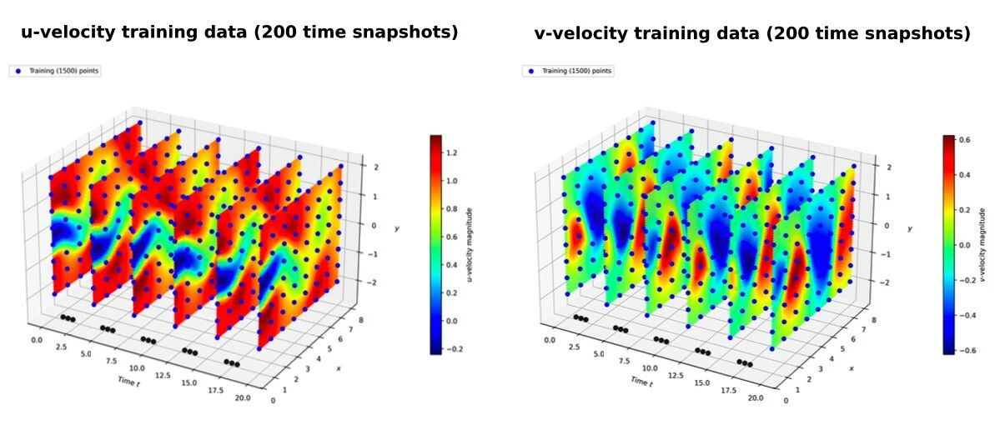
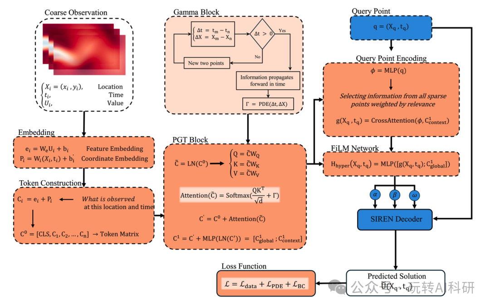
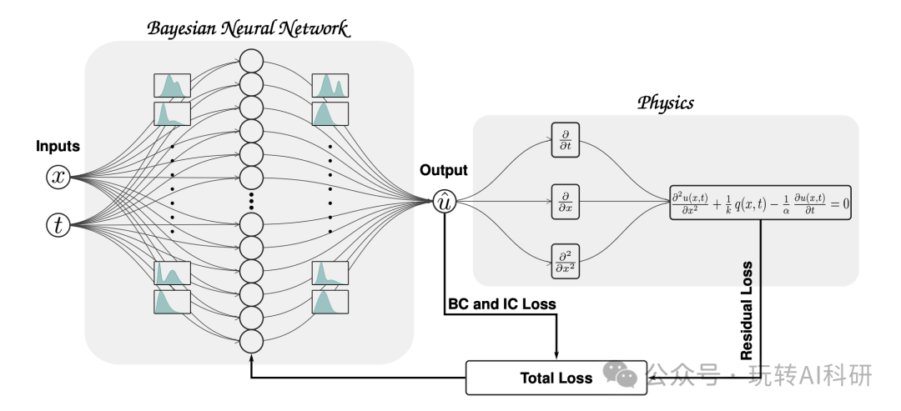
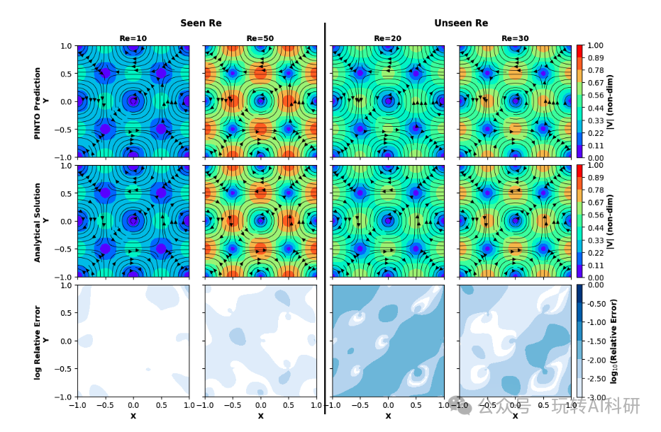
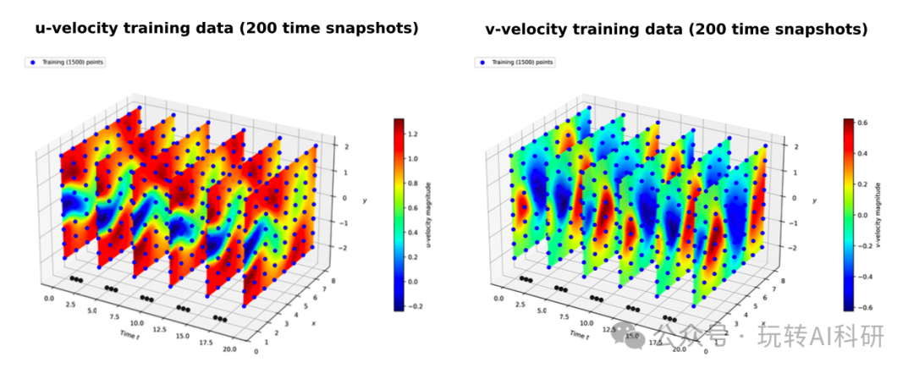
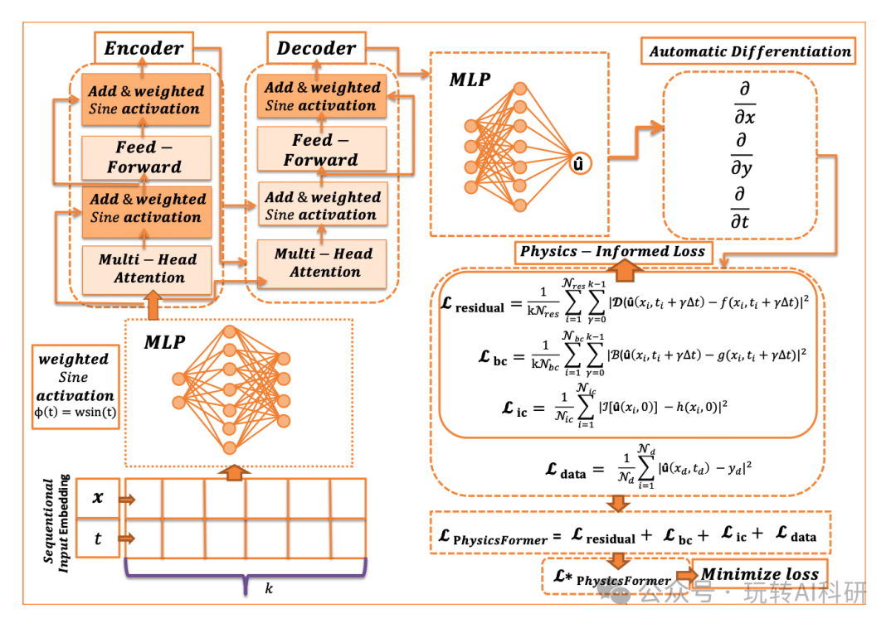
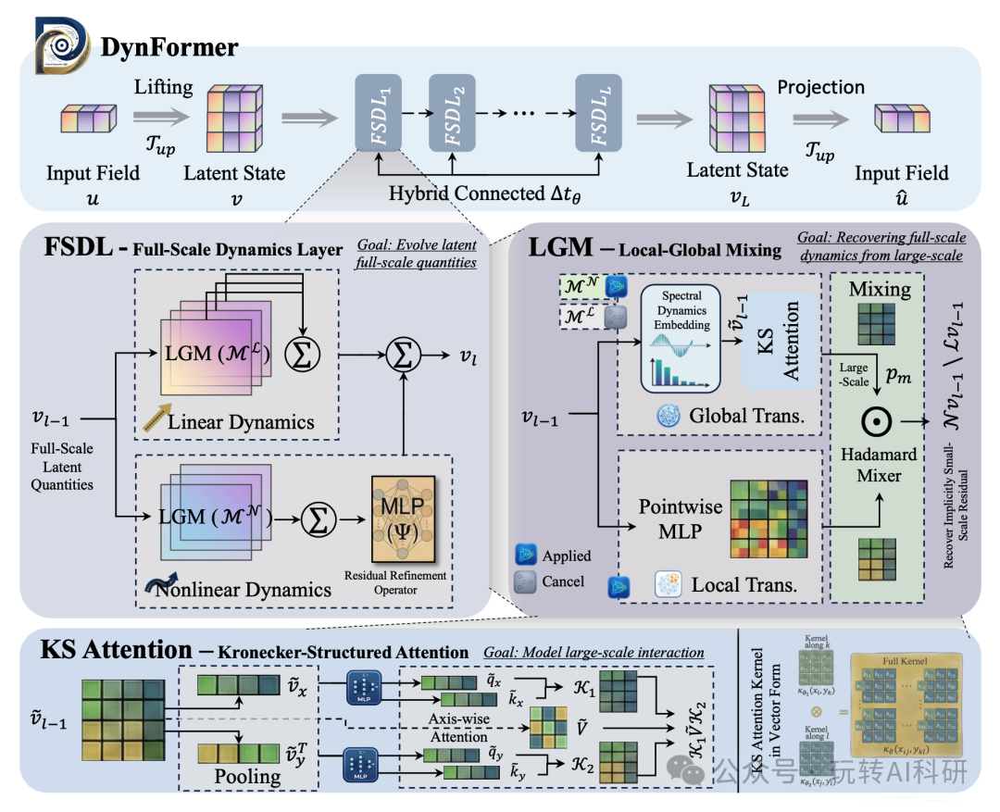

# Transformer+PINN：登Nature子刊新突破 ！！

> 公众号：玩转AI科研 | 发布时间：2026年3月31日 22:18

## 📌 文章概要

**来源**：微信公众号「玩转AI科研」  
**发布**：2026年3月31日  
**主题**：Transformer+PINN：登Nature子刊新突破

---

## 📄 核心内容摘要

### 课题名称
**Transformer与物理信息神经网络（PINN）深度融合：AI驱动科学计算新范式**

### 研究背景与痛点
PINN（物理信息神经网络）将偏微分方程（PDE）作为软约束嵌入网络损失函数，在科学计算领域展现了强大潜力。然而传统基于MLP的PINN存在两大核心瓶颈：①对复杂时空依赖建模能力不足，难以捕捉湍流、扩散等高维问题的长期时序特征；②梯度失衡问题严重，多物理场耦合时各损失项相互干扰，训练不稳定、收敛困难。与此同时，Transformer架构在自然语言处理领域证明了其卓越的序列建模能力，但其与物理约束的深度融合尚处早期探索阶段。

### 解决方案：Transformer-PINN融合路线
围绕"将Transformer的长距离建模能力引入物理信息学习"这一核心，涌现了多条技术路线：

| 方法 | 核心思路 | 关键创新 |
|------|---------|---------||
| **PGT** | 将物理格林函数推导为注意力偏置项，直接嵌入注意力计算 | 编码物理因果性至表示层，从根本上解决梯度失衡 |
| **B-PINN** | 变分推断+贝叶斯框架量化认知不确定性 | 提供置信区间，解决数据稀缺时可靠性问题 |
| **PINTO** | 交叉注意力迭代核积分算子，无仿真数据训练 | 边界条件泛化能力突出，时间外推是独有特性 |
| **PhysicsFormer** | 序列化学习+多头交叉注意力捕捉时变流场 | 加权正弦激活函数增强高频特征，计算速度提升3倍 |
| **DynFormer** | 尺度分解+克罗内克结构注意力降复杂度 | O(N⁴)→O(N³)，95%相对误差降低，突破高分辨率PDE求解瓶颈 |

### 科学与工程价值
- **理论层面**：为Transformer架构与物理先验的深度融合提供了系统性框架，推动神经算子理论发展
- **应用层面**：覆盖流体力学（NS方程）、热扩散、湍流建模、气候预测等关键场景，支撑工程仿真加速
- **工程价值**：稀疏数据下仍保持高精度，为实验数据稀缺的风电、航空发动机等高端制造场景提供可落地AI工具

## 概述

最近Transformer和PINN的结合确实是个热门方向，尤其对研究生来说发paper前景不错。简单说，PINN（物理信息神经网络）擅长嵌入物理方程做科学计算，但传统网络学复杂时空问题挺吃力；而Transformer的长距离建模和注意力机制正好能补这个短板，让它能更好地捕捉物理场的演化规律。这个交叉点容易出成果，因为既蹭了AI的热度，又解决了科学计算的痛点。已经有些高质量论文冒头了，比如今年初有团队用Transformer架构优化PINN求解湍流问题，登了《Nature Machine Intelligence》；还有研究用类似思路做气候建模，发在了《Science Advances》。这些工作核心都是利用Transformer处理序列和依赖关系的优势，显著提升了PINN在长期预报和复杂边界条件下的精度。如果你想切入这个方向，可以琢磨几个创新点：一是设计轻量化的专用注意力机制，降低计算成本；二是把Transformer与多尺度建模结合，提升对多物理场耦合问题的解析能力；三是用元学习思路让模型快速适应不同偏微分方程，增强泛化性。抓住“提升精度”或“突破计算瓶颈”其中一个点，做出扎实的验

## 详细内容

最近Transformer和PINN的结合确实是个热门方向，尤其对研究生来说发paper前景不错。简单说，PINN（物理信息神经网络）擅长嵌入物理方程做科学计算，但传统网络学复杂时空问题挺吃力；而Transformer的长距离建模和注意力机制正好能补这个短板，让它能更好地捕捉物理场的演化规律。这个交叉点容易出成果，因为既蹭了AI的热度，又解决了科学计算的痛点。已经有些高质量论文冒头了，比如今年初有团队用Transformer架构优化PINN求解湍流问题，登了《Nature Machine Intelligence》；还有研究用类似思路做气候建模，发在了《Science Advances》。这些工作核心都是利用Transformer处理序列和依赖关系的优势，显著提升了PINN在长期预报和复杂边界条件下的精度。如果你想切入这个方向，可以琢磨几个创新点：一是设计轻量化的专用注意力机制，降低计算成本；二是把Transformer与多尺度建模结合，提升对多物理场耦合问题的解析能力；三是用元学习思路让模型快速适应不同偏微分方程，增强泛化性。抓住“提升精度”或“突破计算瓶颈”其中一个点，做出扎实的验证，发一篇不错的论文还是挺有希望的。今天要分享给大家20篇最前沿论文，帮助大家可以打开思路~后台回复「论文合集」即可~Physics-Guided Transformer (PGT): Physics-Aware Attention Mechanism for PINNs核心方法:PGT的核心在于将物理结构嵌入Transformer的自注意力机制，而非仅作为损失函数中的惩罚项。具体技术原理是：从控制偏微分方程（PDE）的格林函数（如热方程的格林函数）推导出一个加性的注意力偏置项Γ，并将其直接添加到注意力计算的对数（logits）中。对于扩散问题，Γ正比于负的空间距离平方除以时间间隔，这编码了时空因果性和扩散的局部性。模型架构包含一个物理引导的Transformer编码器，用于处理稀疏观测点生成上下文令牌；一个查询坐标通过交叉注意力从这些令牌中提取特征；以及一个FiLM调制的SIREN解码器，该解码器根据提取的上下文特征自适应地调整其每层的幅度、偏置和频率参数，以生成连续场预测。训练采用不确定性加权的复合损失，自动平衡数据拟合、PDE残差、边界和初始条件损失。创新点:主要创新是将物理先验从外部损失惩罚转变为注意力机制内部的结构性归纳偏置。与PINN等将PDE作为软约束的方法相比，PGT通过Γ项在表示层面直接强制了物理一致性（如时间因果性），从根本上缓解了梯度失衡和优化不稳定的问题。与纯数据驱动的Transformer或神经算子相比，PGT的注意力模式由物理定律引导。与纯隐式神经表示相比，其FiLM-SIREN解码器实现了上下文感知的频谱自适应。这种架构级集成使其在稀疏数据下（如1D热方程仅100个观测点）能同时实现高重建精度（相对L2误差低至5.9e-3）和低PDE残差（在2D纳维-斯托克斯问题中为8.3e-4），这是现有任何单一基线方法未能同时达到的。Physics-Informed Machine Learning for Transformer Condition Monitoring -- Part II: Physics-Informed Neural Networks and Uncertainty Quantification核心方法:论文核心方法为物理信息神经网络及其贝叶斯扩展。PINN通过复合损失函数（公式3）将物理方程（如一维热扩散方程，公式7）的残差（公式2）、边界条件（公式10）和初始条件作为正则化项嵌入网络训练，使用自动微分计算偏导数以约束网络输出。B-PINN进一步将网络权重θ建模为概率分布，采用变分推断（公式11-14）近似后验，通过最大化证据下界（ELBO，公式16）来量化认知不确定性。算法1详细描述了B-PINN的训练流程，包括从变分分布中采样参数、计算物理残差和各项似然。创新点:主要创新在于将PINN与贝叶斯框架结合，应用于变压器热老化建模与不确定性量化。与仅提供确定性预测的传统PINN或纯数据驱动模型相比，B-PINN能提供预测的置信区间（如标准偏差，图7），在数据稀缺时更具鲁棒性。这解决了变压器内部温度监测困难、预测可靠性要求高的具体问题。技术创新点体现在将物理方程残差（公式2, 5）纳入贝叶斯似然函数（公式15），实现了物理一致性与概率预测的统一，为关键资产的健康管理提供了可信任的决策依据。A physics-informed transformer neural operator for learning generalized solutions of initial boundary value problems核心方法:提出PINTO模型，一种基于物理信息损失的Transformer神经算子。其核心是新颖的交叉注意力迭代核积分算子单元。具体实现分为三阶段：1）编码层：使用多层感知机（MLP）分别对时空域查询点坐标（QPE）、边界点坐标（BPE）和边界函数值（BVE）进行编码，将其提升到高维空间（维度m）。2）迭代交叉注意力层：由多个堆叠的交叉注意力单元（CAUs）构成。每个单元计算查询点编码向量（作为Query）与所有边界点编码向量（作为Key）之间的注意力分数，然后对边界值编码向量（作为Value）进行加权求和，从而将边界条件信息注入到查询点的隐式表示中。此过程通过残差连接和Swish激活函数进行更新。3）投影层：使用MLP将最终的边界感知表示向量映射回解空间。训练时仅使用物理残差损失（通过自动微分计算）和边界条件损失，无需任何仿真数据。优化器采用Adam，学习率根据问题设置为1e-5或5e-4，序列长度（边界离散点数L）为60或80。创新点:无仿真数据训练：与FNO、DeepONet等主流神经算子依赖大量仿真数据不同，PINTO仅通过物理信息损失训练，解决了数据获取成本高的问题。 边界条件泛化能力：通过交叉注意力机制，将边界/初始条件函数作为动态上下文显式调制域内点的表示，使模型对完全未见的边界条件具有强大泛化能力，而PI-DeepONet在此方面表现较差。 时间外推能力：PINTO能够预测训练时间域之外的解（如t>1），这是其他物理信息神经算子所不具备的。这些创新通过具体的交叉注意力核积分公式（论文式6-8）实现，在多个PDE测试案例上，其相对误差仅为当前最佳物理信息神经算子（如PI-DeepONet）的20%-33%。PhysicsFormer: An Efficient and Fast Attention-Based Physics Informed Neural Network for Solving Incompressible Navier Stokes Equations核心方法:该方法提出了一种基于Transformer编码器-解码器架构的物理信息神经网络。其核心在于一个“数据嵌入器”，它将时空坐标点转换为包含未来k个时间步长的伪序列，从而将PINNs的点对点学习转化为序列学习。网络采用多头交叉注意力机制捕获长期时间依赖。创新性地引入可训练参数w的加权正弦激活函数φ(t)=w·sin(t)，以增强对混沌流场（如涡旋脱落）高频特征的捕捉能力。训练采用动态加权损失函数，自适应平衡数据拟合项与物理残差项（控制方程、初边值条件）的权重，并使用Adam与L-BFGS优化器进行训练。创新点:主要创新在于首次构建了高效、快速的Transformer-PINNs融合框架，解决了传统多层感知机PINNs难以捕捉时间依赖和高频解的问题。与计算昂贵的PINNsFormer相比，PhysicsFormer通过简化的线性投影层和所提加权正弦激活函数，在保持精度的同时将计算速度提升三倍，并大幅降低GPU内存消耗。在技术实现上，其序列化学习范式与动态损失加权机制，显著提升了在求解复杂时变Navier-Stokes方程正反问题中的收敛速度与精度，如在圆柱绕流逆问题中，对干净数据的参数识别误差可达0%。From Complex Dynamics to DynFormer: Rethinking Transformers for PDEs核心方法:核心方法为DynFormer，一种基于复杂动力学原理的Transformer神经算子。其核心是尺度分解：通过傅里叶变换将物理场分解为低频大尺度分量（pm）与高频小尺度分量（qm）。针对大尺度分量，采用谱嵌入（Spectral Embedding）隔离低频模态，并应用克罗内克结构注意力（Kronecker-structured attention），通过沿坐标轴分解注意力核，将2D网格的复杂度从O(N⁴)降至O(N³)。对于小尺度分量，基于奴役原理（Slaving Principle），认为qm可由pm隐式推导，因此设计了局部-全局混合变换（Local-Global-Mixing， LGM）。LGM通过全局分支（即克罗内克注意力）与局部分支（点式MLP）的哈达玛积（Hadamard product）进行非线性频率混合，隐式重建小尺度湍流，避免了昂贵的全局注意力。多个全尺度动力学层（FSDL）堆叠构成混合演化架构，内部通过多个LGM分支分别逼近线性和非线性动力学算子，并引入可学习的时间步长Δt，模拟自适应龙格-库塔积分。训练使用AdamW优化器，学习率10⁻³，权重衰减0.97，批次大小64，隐藏维度根据Tiny/Medium/Large变体在内存对齐约束下调整。创新点:主要创新在于将复杂动力学的尺度分离与奴役原理深度嵌入Transformer架构设计，彻底改变了传统神经算子对空间点进行均匀、单一注意力处理的范式。具体技术突破包括：1）谱分解与专用模块：通过傅里叶截断显式分离尺度，并为大、小尺度分配专门的计算模块（克罗内克注意力与LGM），这直接解决了传统Transformer在PDE中混合所有频率导致的计算冗余（O(N⁴)）和效率低下问题。2）高效的克罗内克注意力：基于物理场坐标轴可分离的假设，将2D注意力核分解为两个1D核的乘积，实现了从O(N⁴)到O(N³)的复杂度降低，这是与FactFormer等仅基于经验分解的方法的本质区别，具有物理可解释性。3）LGM隐式重建：利用非线性乘法混合而非加法或串联，模拟了物理中的对流非线性，能够从低频载体中生成超出其截断带宽的高频细节，这是实现高精度全场重建的关键。这些创新共同解决了高分辨率、多尺度PDE求解中计算成本与内存消耗的瓶颈，在多个基准测试中实现了高达95%的相对误差降低和显著的内存节省，为构建可扩展、理论坚实的PDE代理模型提供了新蓝图。今天要分享给大家20篇最前沿论文，帮助大家可以打开思路~后台回复「论文合集」即可~

## 图片存档

- 
- 
- 
- 
- 
- 
- 
- 
- 
