# 土木工程领域期刊图形摘要欣赏（二十四）

## 📌 文章概要

**来源**：微信公众号「智慧土木」  
**发布**：2025年12月12日  
**主题**：土木工程领域期刊图形摘要欣赏（二十四）

---

## 📄 核心内容摘要

### 课题名称
**土木工程学术论文图形摘要（Graphical Abstract）设计赏析与规范化研究**

### 研究背景与痛点
学术论文数量激增，图形摘要（Graphical Abstract）成为快速传达研究核心内容的"第一视觉门面"。好的图形摘要能让审稿人和读者在30秒内理解研究全貌，但当前大量土木工程论文的图形摘要存在：
- **信息过载**：试图在一张图里塞入所有技术细节
- **逻辑混乱**：流程图箭头关系不清晰，缺乏主次之分
- **视觉粗糙**：配色杂乱、排版随意，缺乏专业美感
- **缺乏创新**：大量重复使用相同模板，无学科特色

### 解决方案：图形摘要设计范式与期刊案例分析
本合集（第二十四期）精选土木工程领域高水平期刊图形摘要，提炼五类设计范式：

| 类型 | 设计要点 | 适用场景 |
|------|---------|---------||
| **流程型** | 横向箭头串联各研究阶段 | 方法论论文、展示实验流程 |
| **对比型** | 左右/上下对照突出创新 | 参数分析、方案比选 |
| **结构型** | 层级递进展示系统组成 | 框架设计、模型构建 |
| **机理型** | 示意图表达物理机制 | 力学分析、本构模型 |
| **数据型** | 图表结合，数字说话 | 试验研究、监测数据 |

涵盖结构工程、材料力学、地质工程等多个子方向SCI期刊案例，配色讲究专业感与学科特色。

### 科学与工程价值
- **学术传播**：图形摘要是提升论文引用率的"隐形推手"，直接影响研究影响力
- **学科形象**：反映土木工程从"传统经验"向"数字可视化"的现代化转型
- **教学参考**：优秀案例可作为研究生论文写作课的直观教材

## 内容摘要

精选土木工程领域SCI期刊的图形摘要，展示该领域前沿研究成果的可视化表达方式，涵盖结构工程、材料力学、地质工程等多个子方向。

## 图片存档

- 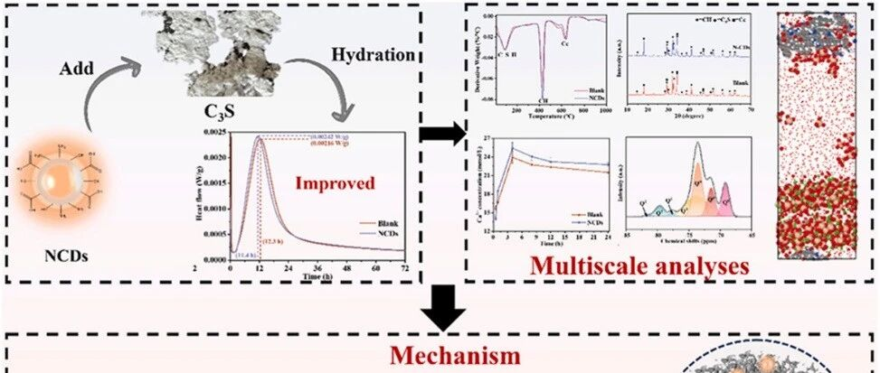
- 
- 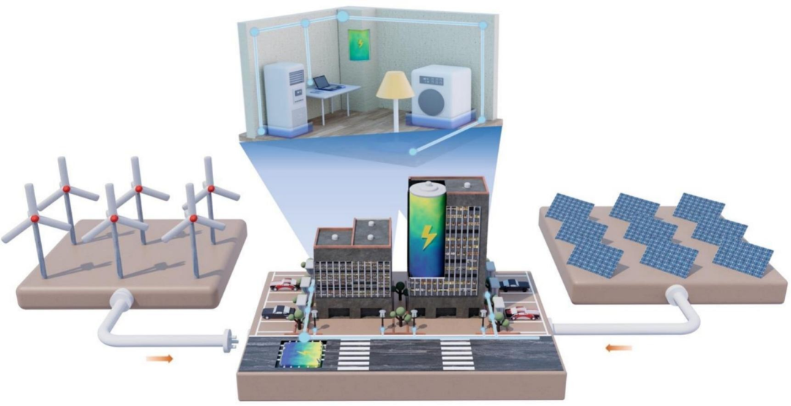
- 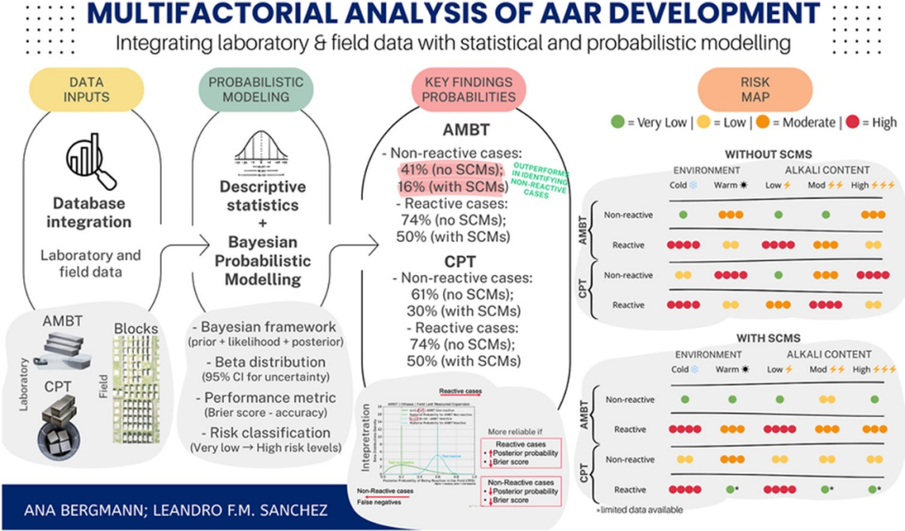
- 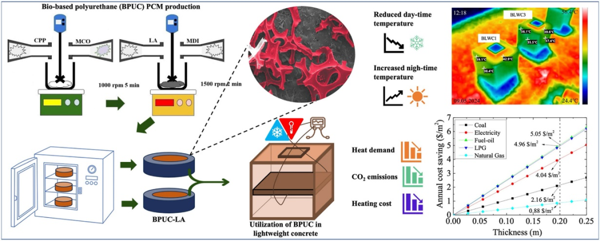
- 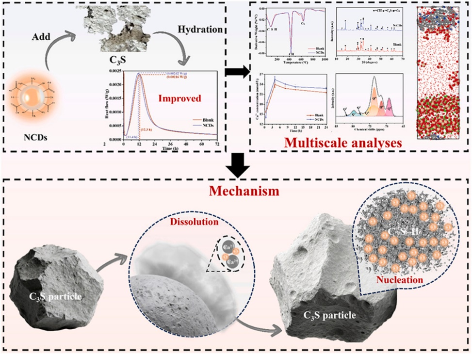
- 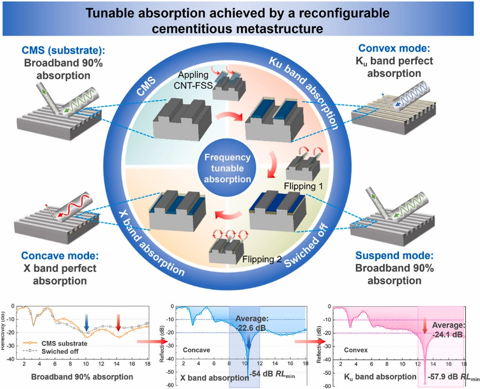
- 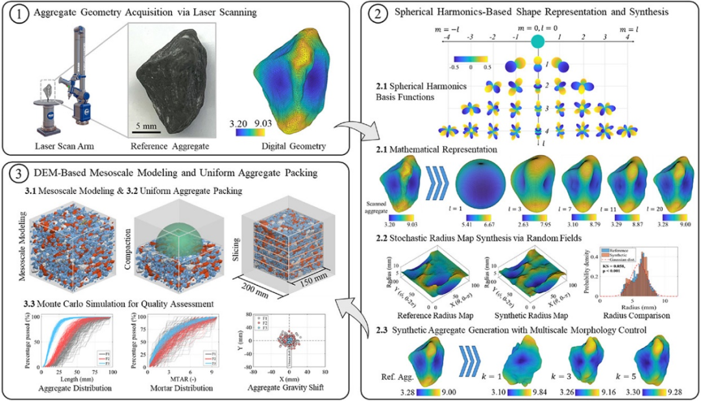
- 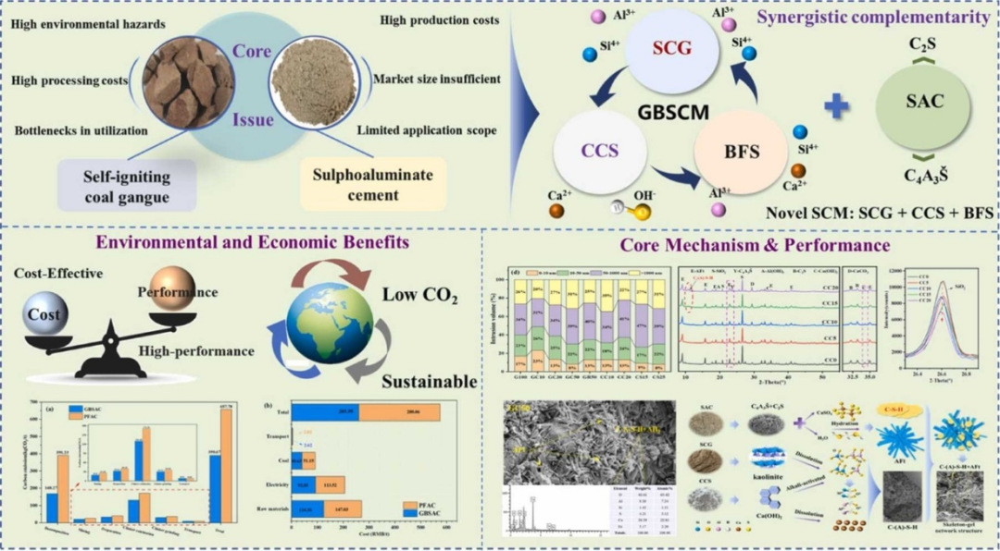
- 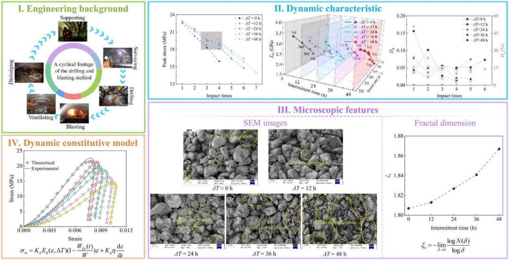
- 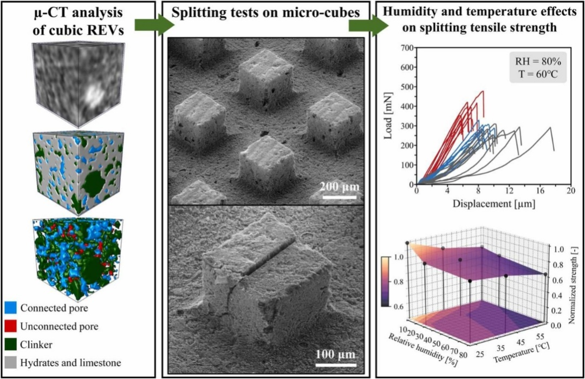
- 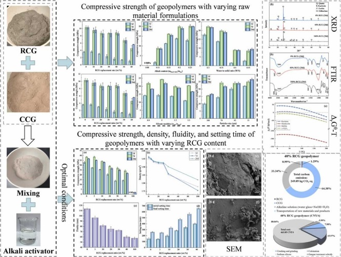
- 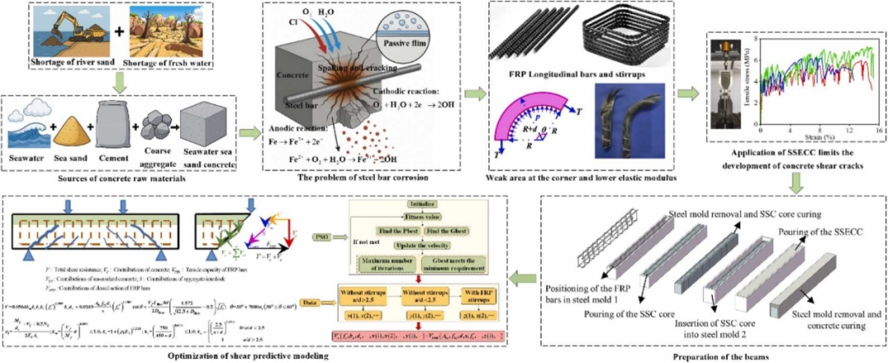
- 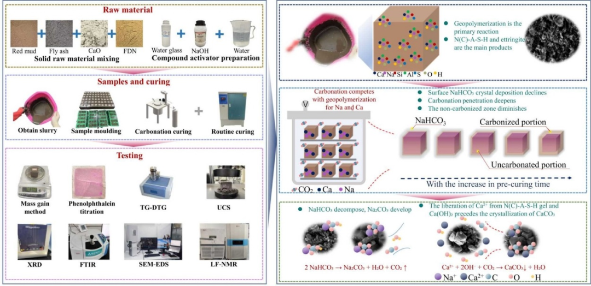
- 
- 
