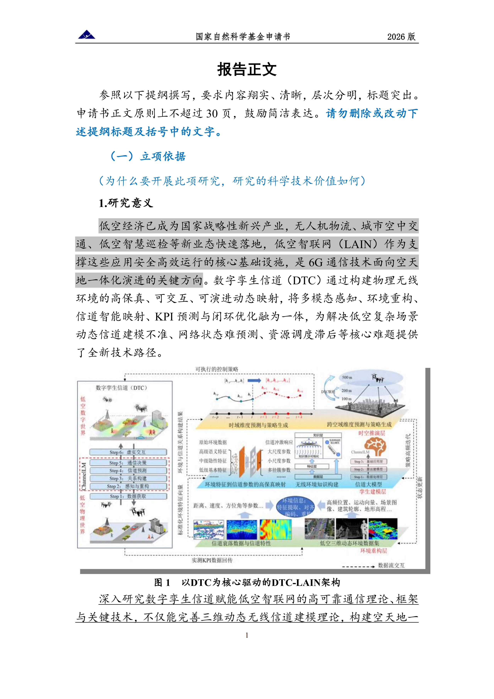
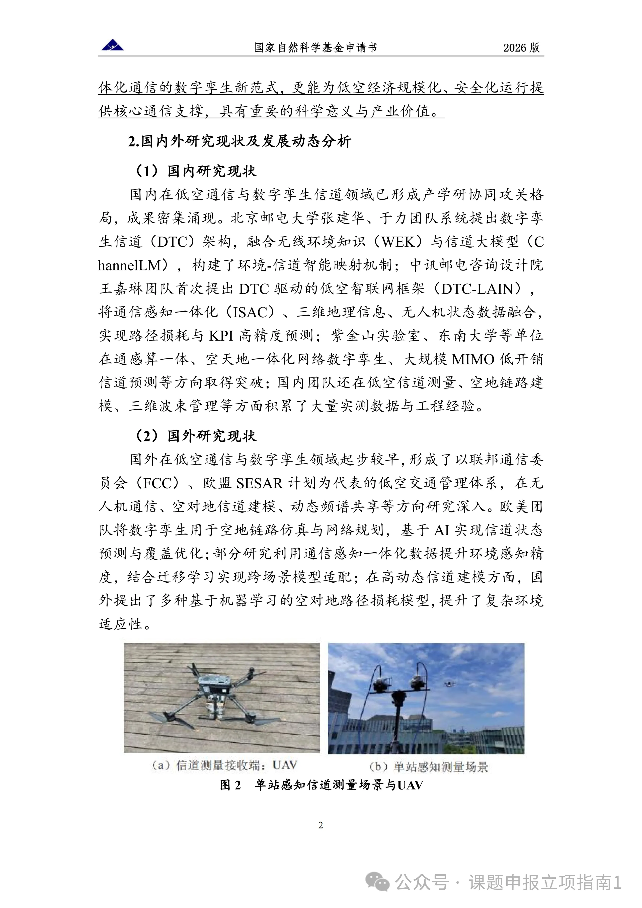
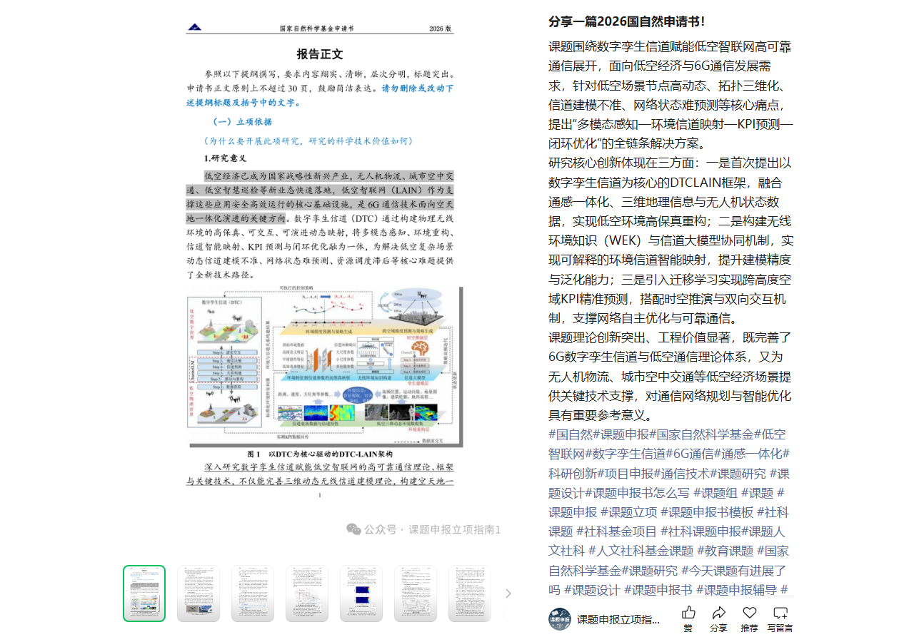

# 分享一篇2026国自然申请书！

## 📌 文章概要

**来源**：微信公众号「课题申报立项指南1」  
**发布**：2026年3月17日 19:54  
**主题**：2026版国家自然科学基金申请书范文 —— 数字孪生信道赋能低空智联网高可靠通信

---

## 📄 核心内容摘要

### 课题名称
**数字孪生信道赋能低空智联网高可靠通信**

### 研究背景与痛点
低空经济已成为国家战略性新兴产业，无人机物流、城市空中交通、低空智慧巡检等新业态快速落地。**低空智联网（LAIN）** 作为支撑这些应用安全高效运行的核心基础设施，是6G通信技术面向空天地一体化演进的关键方向。

核心痛点：
- 低空场景节点**高动态**
- 拓扑**三维化**
- 信道建模**不准**
- 网络状态**难预测**

### 解决方案：DTCLAIN框架
提出 **"多模态感知—环境信道映射—KPI预测—闭环优化"** 的全链条解决方案：

| 创新点 | 内容 |
|--------|------|
| **创新一** | 首次提出以数字孪生信道为核心的 **DTCLAIN 框架**，融合通感一体化、三维地理信息与无人机状态数据，实现低空环境高保真重构 |
| **创新二** | 构建无线环境知识（WEK）与**信道大模型协同机制**，实现可解释的环境信道智能映射，提升建模精度与泛化能力 |
| **创新三** | 引入**迁移学习**实现跨高度空域KPI精准预测，搭配时空推演与双向交互机制，支撑网络自主优化与可靠通信 |

### 科学与工程价值
- **理论层面**：完善6G数字孪生信道与低空通信理论体系
- **应用层面**：为无人机物流、城市空中交通等低空经济场景提供关键技术支撑
- **工程价值**：对通信网络规划与智能优化具有重要参考意义

---

## 📸 原文页面截图

> 微信文章以**图片形式嵌入申请书正文**，共多页。以下为已保存的页面：

*第1页：立项依据、研究意义、DTCLAIN架构图*

*第2页：国内外研究现状及发展动态分析*

*微信文章全页截图*

---

## 🏷️ 标签

#国自然 #课题申报 #国家自然科学基金 #低空智联网 #数字孪生信道 #6G通信 #通感一体化 #科研创新 #项目申报 #通信技术 #课题研究 #课题设计 #课题组 #课题申报书模板 #社科课题 #教育部人文社科

---

*归档时间：2026-04-23 | 抓取方式：Playwright headless Chromium | 原文链接：[点击查看](https://mp.weixin.qq.com/s/gAi93zEdyf09-8HHoGNtug)*
