# 理解、感知、规划三位一体！华科大&小米发布UniDriveVLA，打造统一自动驾驶新范式

> 公众号：深蓝AI | 发布时间：2026年4月17日

## 内容摘要

华中科技大学与小米联合发布UniDriveVLA，一个将理解、感知、规划统一建模的自动驾驶端到端系统。该架构在多个 benchmark 上刷新 SOTA，同时保持良好的可解释性。

## 图片存档

- 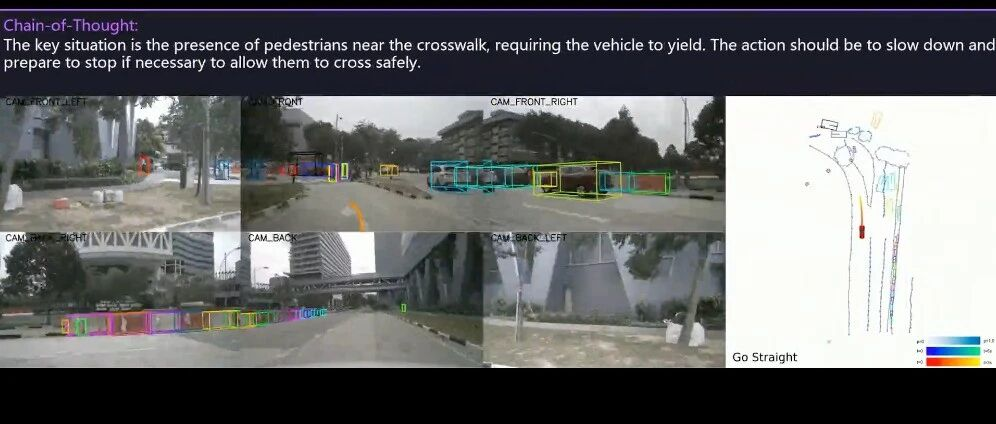
- 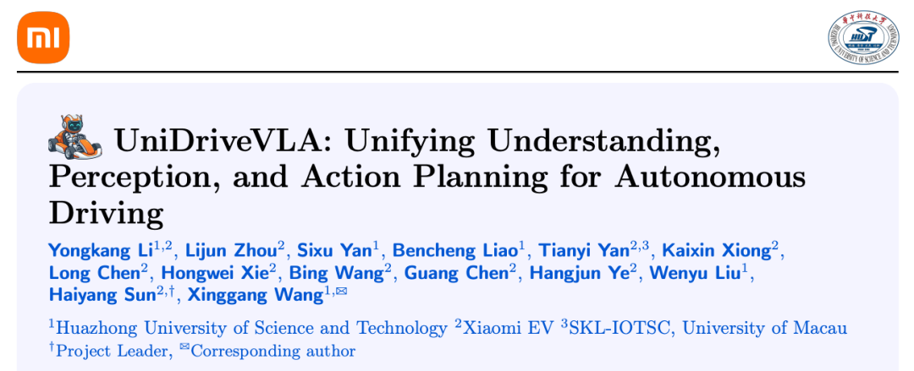
- 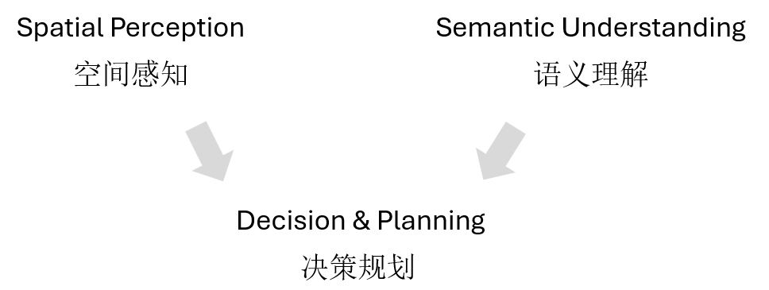
- 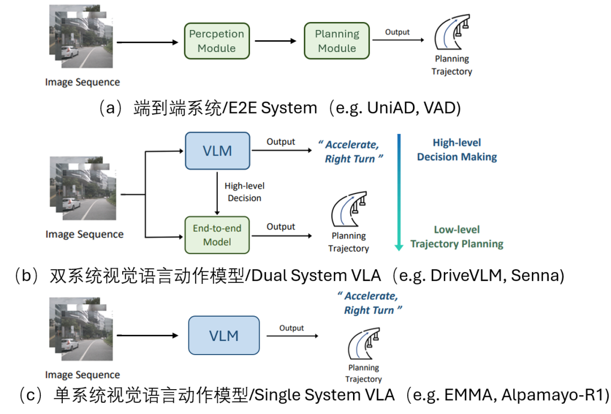
- 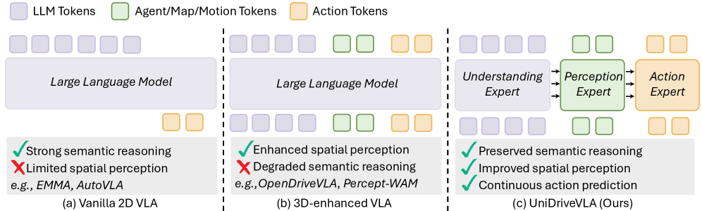
- 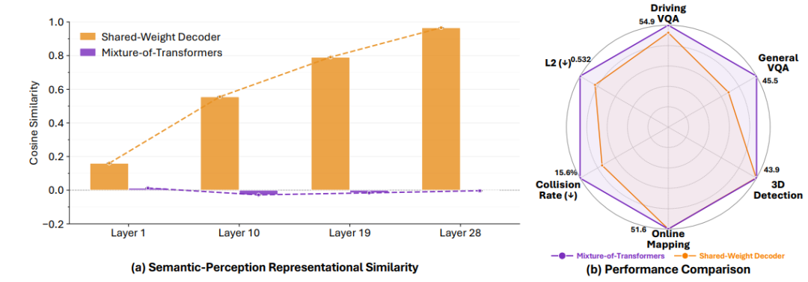
- 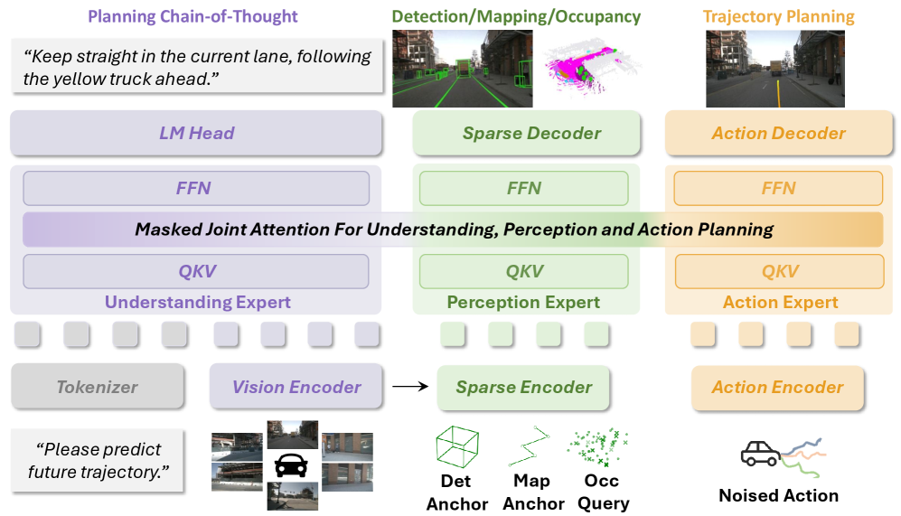
- 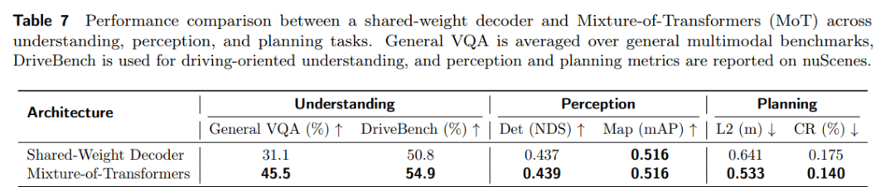
- 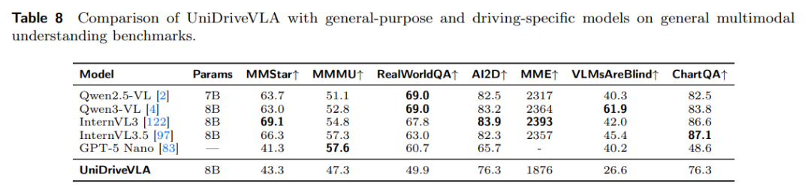
- 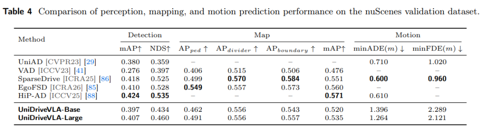
- 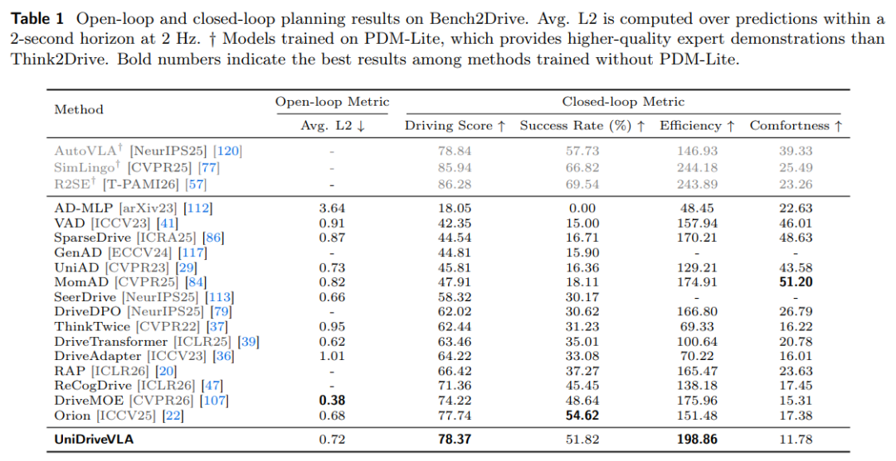
- 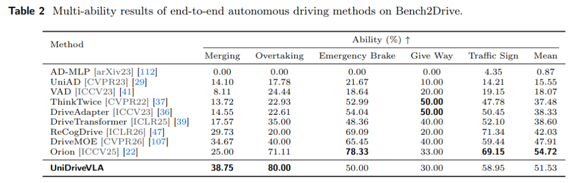
- 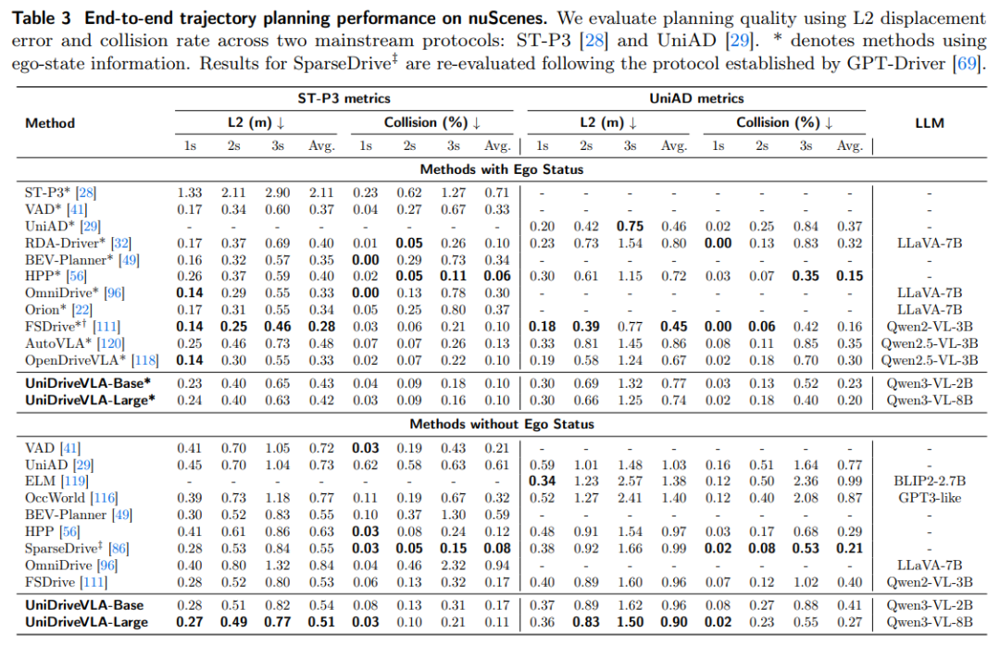
- 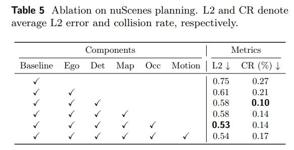
- 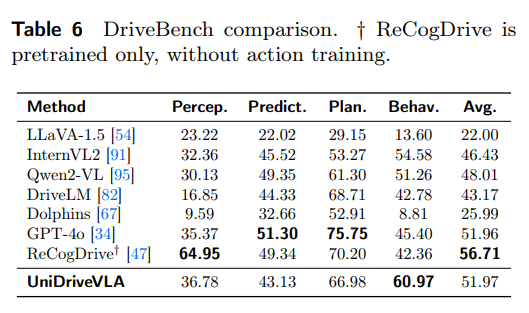
- 
- 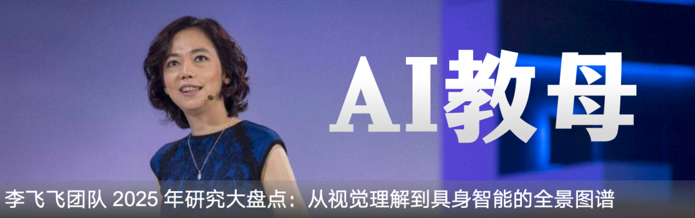
- 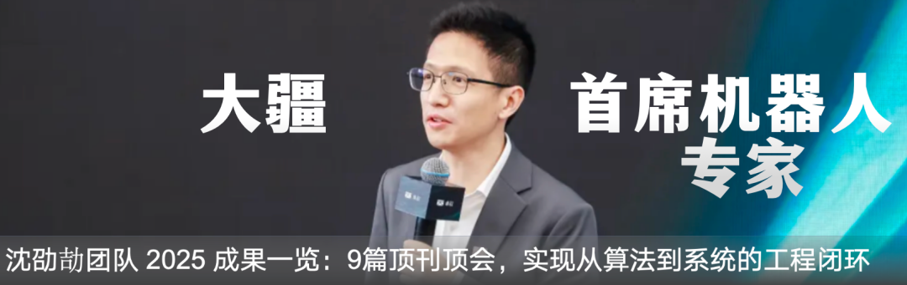
- 
- 
- 
- 
